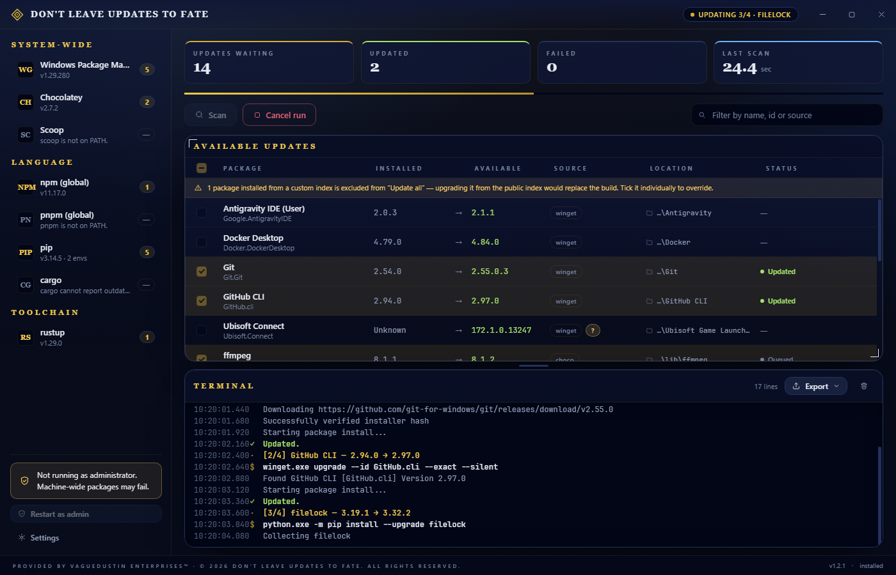
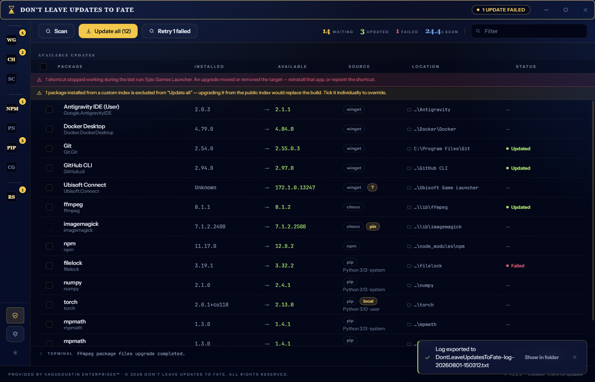
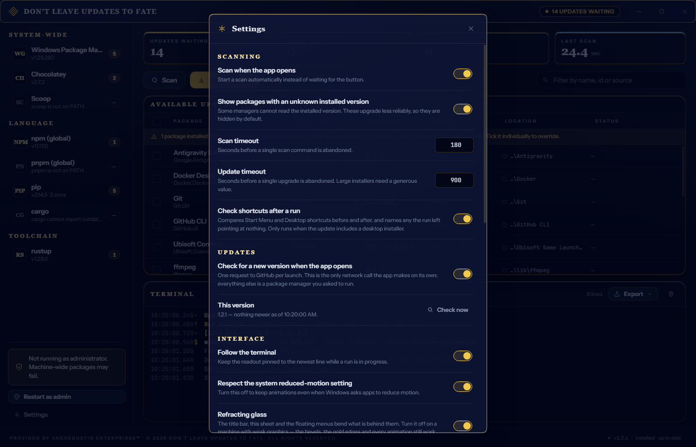
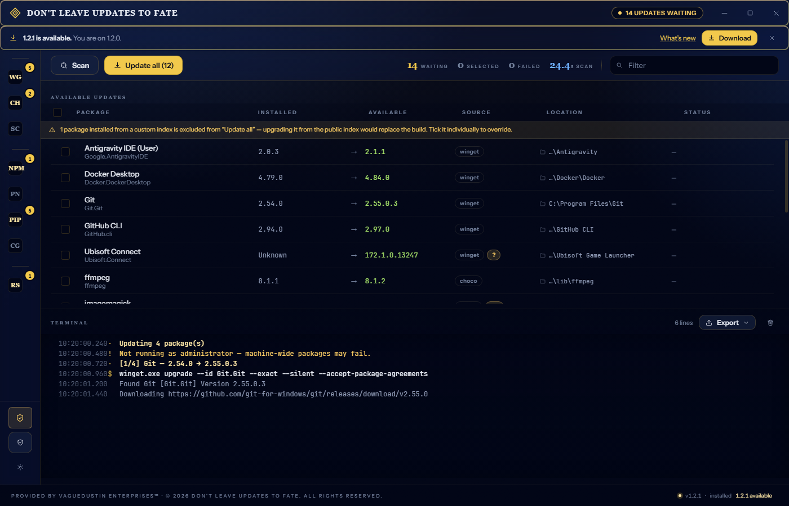

<div align="center">

<h1></h1>

**Every manager on this machine, read in one pass.**

A Windows desktop app that asks every package manager on your system what has fallen behind, then
updates them one at a time with a live terminal readout you can export.

Provided by VagueDustin Enterprises™.

</div>



---

## What it does

Presses one button and asks winget, Chocolatey, Scoop, npm, pnpm, pip, cargo and rustup what is out of
date. Shows the lot in one table — installed version, available version, which manager it came from —
and updates what you select, one package at a time, streaming every line of output as it happens.

- **One pass over everything.** Managers are scanned concurrently; the table fills in as each reports.
- **pip, per interpreter.** A Windows box usually has several Pythons. All of them are enumerated
  through the Python launcher and scanned separately, so nothing hides behind whichever `pip` happens
  to be first on `PATH`.
- **Updates run one at a time.** Two installers writing to the same tree is how an install gets
  corrupted, and a single stream is the only way the terminal stays readable.
- **Where it is, on disk.** Every row carries the install location. Click it to open Explorer with the
  folder selected, or copy the full path. See [Locations](#locations) for how each manager is asked.
- **A real terminal readout.** Every command is echoed before it runs, so an exported log reads as a
  transcript you could replay by hand.
- **Export the log** as plain text, Markdown or JSON, with a header recording app version, Windows
  build, whether the run was elevated, and the version of every manager involved — followed by a
  package inventory: what was found, what happened to it, and where it lives.
- **Honest about elevation.** winget and Chocolatey install machine-wide. The app starts unelevated,
  notices, and offers one button to restart with administrator rights rather than letting forty
  packages fail on permissions.
- **Cancel means cancel.** Cancelling kills the process *tree*, so winget's installer child and
  choco's embedded PowerShell go with it.
- **It updates itself.** Checks GitHub for a newer release on launch, verifies the download against
  the published checksum, and hands over to it. See [Updating itself](#updating-itself).

---

## Screenshots

<table>
<tr>
<td width="50%">

**A run that finished with something to say.** Two packages updated, one failed on permissions and is
offered a retry, one custom-index build held back from "Update all" — and a shortcut that stopped
resolving during the run, which is the check that exists because an upgrade can return exit code 0 and
still leave an app unlaunchable.

</td>
<td width="50%">

[](docs/screenshots/preview-finished.png)

</td>
</tr>
<tr>
<td width="50%">

**Settings.** Scan behaviour, timeouts, the shortcut check, the update check, and the list of packages
you have told it to stop offering — either for one version or for good.

</td>
<td width="50%">

[](docs/screenshots/preview-settings.png)

</td>
</tr>
<tr>
<td width="50%">

**It updates itself.** A strip under the title bar when there is a newer release, with a link to the
notes and nothing fetched until you press Download. See [Updating itself](#updating-itself).

</td>
<td width="50%">

[](docs/screenshots/preview-update.png)

</td>
</tr>
</table>

> These come from the design harness (`npm run dev` has a sibling at
> `scripts/preview-server.mjs`), which mounts the real UI against synthetic data. That is deliberate:
> a screenshot of a real machine is a screenshot of somebody's installed software and file paths.
> Everything on screen is the shipped interface; only the packages are invented.

---

## Install

**[Download the latest release →](https://github.com/VagueDustin/DontLeaveUpdatesToFate/releases/latest)** · [Release history](#release-history)

Two builds, both x64, both Windows 10 1809 or newer:

| Artifact | What it is |
| --- | --- |
| `DontLeaveUpdatesToFate-1.2.1-portable.exe` | Single file. Run it from anywhere, installs nothing. |
| `DontLeaveUpdatesToFate-1.2.1-setup.exe` | Normal installer — pick a directory, Start Menu entry, Add/Remove entry. |

Both are **unsigned**. Without a code-signing certificate, SmartScreen shows
"Windows protected your PC" on first run — *More info* → *Run anyway*. Signing is the only real fix;
nothing in the app can suppress that warning, and anything claiming to would be worth distrusting.

Installs to `C:\Program Files\VagueDustin Enterprises\Don't Leave Updates To Fate` — the publisher
folder, alongside the other products already there. The directory page still lets you change it.
Publisher reads `VagueDustin Enterprises` in Add/Remove Programs and as CompanyName on both binaries.

### Elevation

The app deliberately starts **unelevated** so scanning your npm globals doesn't need a UAC prompt.
When a run needs administrator rights, use **Restart as admin** in the sidebar. Machine-wide managers
(winget, Chocolatey, and any system-wide Python) will fail without it, and the app says so in the
failure detail rather than making you read the transcript.

**How the relaunch works, and why it looks abrupt.** The window closes, then the elevated copy opens.
That ordering is deliberate: a helper waits for the original process to exit *before* starting the
elevated one, so the two never coexist and the new instance cannot lose the single-instance lock. An
earlier version started the elevated copy first and tried to hand the lock over; it lost that race
every time, and the symptom was a button that appeared to do nothing.

Whether you see a UAC prompt depends on your own policy. With
`ConsentPromptBehaviorAdmin = 0` ("elevate without prompting") Windows elevates silently and no dialog
appears — that is Windows behaving as configured, not the app skipping a step. If elevation is
declined, nothing reopens; relaunch normally.

Each launch appends a few lines to `%APPDATA%\dont-leave-updates-to-fate\startup.log`, including
`elevated=true|false`. That exists because a process which exits during startup otherwise leaves no
evidence at all, which is precisely the case that is hardest to diagnose.

### Updating itself

On launch the app asks `api.github.com` for this project's latest release and compares the tag with
the running version. If there is something newer, a strip appears under the title bar: what version,
what you are on, a link to the notes, and a Download button. Nothing is fetched until you press it.

The download goes to your **Downloads** folder and is hashed as it arrives, then checked against the
`SHA256SUMS` file published with the release. A mismatch deletes the file rather than leaving a
half-verified installer on disk, and a successful install removes it afterwards. (Downloads is a
deliberate choice, not laziness — see the 1.2.1 notes below. Only files matching this app's own
artifact names are ever deleted from there.) **Be clear about what that proves**: the
checksums come from the same release as the binary, so they catch a truncated or corrupted download
and nothing more. Whether the release itself is honest is what code signing answers, and these builds
are not signed.

Installing depends on which build you have, and each gets the right artifact — handing an installed
user a portable exe leaves them with a second unmanaged copy, and handing a portable user an installer
silently converts their "installs nothing" choice into an install.

| Build | What "install" does |
| --- | --- |
| Installed | Closes the app, then runs the installer's normal wizard. Not `/S` — silently replacing an application is not a thing software should do to someone, even at their own request. |
| Portable | Closes the app, overwrites the exe you double-clicked with the new one, and starts it again. |
| Unpackaged (`npm run dev`) | Checks, but is never offered an artifact. |

Both paths hand off to a helper that calls `Wait-Process` on this process id before touching anything,
because you cannot replace a running executable on Windows and racing the exit is how you get a
half-written binary. The portable swap then waits for the exe to become **writable** rather than
merely for us to be gone: the portable build is a stub that extracts the app to a temp directory, and
our own exit is the start of its cleanup, not the end.

Starting a process that outlives this one turns out to be the hard part, and `handover.ts` does not
assume any one way works. It tries `Start-Process`, then WMI, then a detached `spawn`, and a mechanism
only counts once the helper has written a marker file proving it ran — two of the three report success
on a machine where they do nothing at all. Every attempt is recorded in
`%APPDATA%\dont-leave-updates-to-fate\updates\handover.log`.

**The check is the only network request this app makes on its own.** Everything else is a package
manager you asked to run. It is one call per launch, and Settings turns it off — the manual *Check
now* button still works.

Why not `electron-updater`, since it exists and does most of this: it cannot update a portable build
at all, which would leave half of what ships here with no update path; its integrity story is code
signing, which these unsigned builds cannot use, so the one check it adds is the one that cannot
apply; and it wants a `latest.yml` published alongside the artifacts, which a release can silently
forget. The full reasoning is in the header of `src/main/release.ts`.

---

## Locations

Every row shows where the package actually lives. Clicking the path opens Explorer with that folder
selected, and the row menu (⋯) offers **Show in Explorer** and **Copy path** alongside the skip
actions. The location is searchable, so `site-packages` or `Program Files` narrows the table, and it
is included in every log export.

The path is shortened from the **left**, keeping the last folder or two: everything that identifies
which package a row is about lives at the end, so a right-side ellipsis would render the same useless
`C:\Users\dev\AppData\Loc…` on every row. How much survives depends on how wide the column actually
is, measured from the live layout rather than assumed — at 1295px it shows `…\torch`, at 1920px
`…\site-packages\torch`. The full path is always in the tooltip.

No manager has a `--where-is-it` flag, so each is asked in the way that manager can answer:

| Manager | How the location is found |
| --- | --- |
| winget | Its `Name` column is verbatim the Add/Remove Programs `DisplayName`, so the registry is read once per scan and rows are matched back by name. Portable packages are found by id under `%LOCALAPPDATA%\Microsoft\WinGet\Packages`. |
| Chocolatey | `%ChocolateyInstall%\lib\<id>`, falling back to walking up from the resolved `choco.exe` when the variable is not set in this process. |
| Scoop | `<root>\apps\<name>\current`, checking `%SCOOP%`, `%SCOOP_GLOBAL%` and the defaults. |
| npm | `npm outdated --json` reports it directly — the one manager that hands the answer over. |
| pnpm | `pnpm root -g`, joined with the package name. |
| pip | One `importlib.metadata` pass per interpreter, fed to `python -` on **stdin**. Reports the package's own folder, not `site-packages`. |
| rustup | `%RUSTUP_HOME%\toolchains\<name>`; the `rustup` row itself points at the cargo bin directory. |
| cargo | `%CARGO_HOME%\bin` — everything `cargo install` produces is a binary in one place. |

Three rules keep it honest:

- **Nothing is shown that is not there.** Every candidate is confirmed on disk before it becomes a
  location. A manager that cannot answer gets a dash, and the tooltip says which manager declined.
- **A guess is worse than a dash.** Names are matched exactly first, then loosely — with the version
  and the `(64-bit)` suffix stripped, because `CPUID CPU-Z 2.20` in winget's list is `CPUID CPU-Z 2.21`
  in the registry the moment the upgrade lands. Any loose key that two different applications claim is
  **dropped**: three .NET runtimes that differ only by version must produce no answer rather than send
  you to whichever was enumerated first.
- **`MsiExec.exe /X{GUID}` is not an install location.** Deriving a path from an uninstall string is
  useful when it is the application's own uninstaller and useless when it is the shared one, so the
  msiexec case is rejected outright. When both an icon path and an uninstaller path exist, the one at
  or above the other wins — OBS Studio's icon is `…\obs-studio\bin\64bit\obs64.exe` and its uninstaller
  is `…\obs-studio\uninstall.exe`; the root is the useful answer.

It costs nothing on the clock. The registry read runs **concurrently** with `winget upgrade`, which
spends its six seconds waiting on the catalogue anyway, and the pip locators all start before the first
`pip list --outdated`.

---

## Skipping updates

Two scopes, on the ⊘ button of any row:

- **Skip this version** — declines one specific available version. The package reappears on its own as
  soon as the manager offers something newer. For "not this build, it's broken".
- **Never update this** — the package is never offered again. For "this app manages its own updates" or
  "upgrading it through a package manager breaks it".

Both are listed in Settings → Skipped packages with an Un-skip button, and both are enforced in the
main process: skipped packages are dropped as each manager reports, so nothing downstream — the table,
the counts, "Update all" — can offer one. A stale key from the renderer is re-checked before any upgrade
runs.

Rules match on `provider:id`, deliberately not on the item key. The key includes the environment, so
keying on it would skip `torch` under Python 3.10 while still offering it under 3.13 — almost never what
anyone means.

**Epic Games Launcher is skipped out of the box.** Upgrading it through winget demonstrably breaks it:
Epic's MSI reports `Installation completed successfully`, then relocates its binaries and leaves every
existing Desktop and Start Menu shortcut pointing at a path that no longer exists. Epic keeps itself
updated anyway. Remove the rule in Settings if you disagree.

Note the limit: `winget upgrade` enumerates everything in one command and has no per-package opt-out, so
a skipped package is still *listed* by winget — this app discards it immediately and can never act on
it. If you want winget itself to stop tracking something, `winget pin add --id <id>` does that globally.

## Safety guards

All of these came out of real runs on a real machine, not from theory.

**An upgrade that returns success is verified, not trusted.** Exit code 0 does not mean the app still
starts. Before a run, the app takes a census of every shortcut in the Start Menu and on the Desktop
(all-users and per-user) and records which targets resolve; afterwards it takes the census again and
reports any shortcut that *used to* work and now doesn't. That names the breakage without needing
per-package knowledge — it catches the Epic case and anything else shaped like it. Shortcuts that were
already broken, or removed cleanly by an uninstall, are not reported.

The census only runs when the update actually includes a desktop installer — winget, Chocolatey or
Scoop. Enumerating four Start Menu trees and resolving every `.lnk` through COM takes seconds at both
ends of a run, and forty pip upgrades cannot break a shortcut. It is announced in the transcript either
way, and can be switched off in Settings.

**Custom-index builds are held back.** A package whose installed version carries a PEP 440 local
version identifier — the `+cu118` in `torch 2.0.1+cu118` — was installed from a custom index. The
public index has no such build, so `pip install --upgrade` does not update it, it *replaces* it. On the
machine this was built on that turned `torch 2.0.1+cu118` into `torch 2.13.0+cpu` and took CUDA support
with it. Those rows are now flagged `local`, excluded from "Update all", and have to be ticked
deliberately.

**Application-bundled interpreters are never touched.** pip environments come from the Python launcher
(`py -0p`), which lists only *registered* installs. A venv belonging to an application — ComfyUI's
`.venv`, Forge's `system\python` — is not registered and so is invisible to a scan. That is why the
run above hit a dormant standalone 3.10 and left both working Stable Diffusion installs alone. If you
want such an environment managed, register it; the default is to leave application environments be.

**Winget results are classified, not guessed.** Exit codes are matched against the HRESULT table
transcribed from `AppInstallerErrors.h`, and always reported in hex — `0x8A15008E` can be searched for,
`-1978335090` cannot. Reboot-required codes count as successes rather than failures. "In use" and
network codes are marked retryable and drive the **Retry N failed** button, so recovering from "close
OBS and try again" no longer means a full rescan and re-selection.

**Every session is written to disk as it happens**, under
`%APPDATA%\dont-leave-updates-to-fate\logs`, pruned after 14 days. The in-memory buffer alone meant a
crash or a close lost the entire transcript — and made a run impossible to inspect from outside.

---

## Supported managers

| Manager | Scan command | Upgrade command | Verified against real output |
| --- | --- | --- | --- |
| winget | `winget upgrade --include-unknown` | `winget upgrade --id <id> --exact --silent` | ✅ 39 packages |
| Chocolatey | `choco outdated --limit-output` | `choco upgrade <id> --yes` | ✅ 10 packages |
| npm | `npm outdated --global --json` | `npm install --global <id>@latest` | ✅ |
| pip | `<python> -m pip list --outdated --format=json` | `<python> -m pip install --upgrade <id>` | ✅ 3 interpreters |
| rustup | `rustup check` | `rustup update <toolchain>` / `rustup self update` | ✅ |
| Scoop | `scoop status` | `scoop update <id>` | ⚠️ format only — not installed here |
| pnpm | `pnpm outdated --global --json` | `pnpm add --global <id>@latest` | ⚠️ format only — not installed here |
| cargo | `cargo install-update --list` | `cargo install-update <id>` | ⚠️ needs `cargo-update` |

The three marked ⚠️ are implemented from their documented output formats but could not be exercised on
the machine this was built on, because those tools aren't installed. They are built to **fail safe**:
an unrecognised format yields zero rows rather than wrong rows, since a row is only accepted when it
has a usable id and a version that is genuinely newer than what is installed.

`cargo` reports itself as present-but-incapable until you install the subcommand that can actually
answer the question:

```bash
cargo install cargo-update
```

### Scope

**Not included: `pipx` and `dotnet tool`.** Both list installed versions but neither CLI has an
outdated command — reporting on them would mean querying PyPI and NuGet directly, which is a different
feature with different failure modes. Better to omit them than to imply coverage that isn't there.

**Scoop caveat.** `scoop status` compares against your *local* bucket manifests, which are refreshed by
`scoop update` (a git pull on every bucket). This app does not run that: mutating your buckets as a
side effect of pressing Scan would be a surprise. Refresh them yourself for current results.

---

## Design

The UI follows the VagueDustin house design system — theme `gold-navy`, ornament tier raised to
**charted**. That system lives in a private repository, so what you can see of it here is what
matters anyway: the vendored tokens, the rules written into the CSS, and the guardrail that enforces
them.

`gold-navy` is the hallmark utility theme, and the system's rule is to raise the tier to `charted` for
"maps, charts, instruments, long-session tools". An update console you sit and watch is exactly that:
Cinzel headings over Inter body, gold behaving as engraving rather than glow, corner brackets and film
grain kept, glass on overlays, no ambient motion, at most three decorative animations at once.

Tokens are vendored into `src/renderer/src/styles/brand/` so a packaged build is reproducible offline —
and so this repository is complete without the private one.
`npm run lint:brand` enforces the house rule that **no raw colour value appears in product source** —
only `src/shared/brand-tokens.ts` (values Chromium needs before any stylesheet exists) and
`resources/icon*.svg` (a raster icon can't resolve a CSS variable) are exempt.

Fonts are self-hosted via `@fontsource` rather than Google's CDN: a packaged build runs from `file://`
under a CSP that forbids external origins, and an installed app has to look right offline.

---

## Development

```bash
npm install
npm run dev          # Electron with HMR
npm run verify       # typecheck + brand check + unit tests
npm run dist         # both Windows artifacts into dist/
```

| Script | Does |
| --- | --- |
| `npm run dev` | electron-vite dev server with HMR |
| `npm run verify` | typecheck (main + renderer), brand guardrail, 110 unit tests |
| `npm test` | unit tests only |
| `npm run icons` | regenerate `resources/icon.ico` + installer art from the SVG sources |
| `npm run dist:portable` | portable exe only |
| `npm run dist:installer` | NSIS installer only |

### Testing

**Unit tests (`npm test`)** — 226 tests, hermetic. Every parser runs against fixtures in
`tests/fixtures/` that are verbatim stdout captured from winget, choco, npm, pip, rustup and the Python
launcher on a real machine. That matters because the failure mode here is a parser that looks correct
and silently drops or mangles rows, which is invisible without a real sample. Two genuine bugs were
caught this way: a trailing-`\r` handler that blanked every line of CRLF output, and a separator-row
regex that missed PowerShell's space-separated dashes.

`tests/locations.test.ts` covers the location resolvers separately, because their failure mode is
different in kind: not a dropped row but a confident, wrong path. Registry name matching, the msiexec
rejection, the ambiguous-name drop and path traversal all have cases.

`tests/release.test.ts` does the same for self-update, against a verbatim capture of the GitHub API
payload. Its failures are quiet and expensive — offering the wrong artifact, matching a checksum
against the wrong filename, getting the version comparison backwards — and none of them announce
themselves. One of these tests caught a real one before it shipped: a `dev` build was being offered
the installer, producing a Download button that led somewhere `install()` would refuse to go.

**Integration tests** — opt in, because they spawn real package managers:

```bash
FATE_INTEGRATION=1 npx vitest run tests/integration.test.ts
```

Covers the paths that only break against a real process: streaming arrival times, tree-kill on cancel,
timeout handling, spawn failure, and a well-formedness sweep over every available provider.

It also covers location resolution, which is the one part of the app that fixtures cannot prove —
everything else parses text, but these read the registry, walk manager roots and ask interpreters about
themselves. A resolver that quietly answered null for every row would pass every unit test in the suite
and ship a column of dashes, so the assertion is a coverage floor measured against whatever is actually
installed, plus a check that every path it reports is really on disk. The update check runs against
the live API there too, so a renamed field in GitHub's response cannot leave the app quietly
believing it is always current.

The upgrade path needs a second flag, because unlike the rest it changes the machine:

```bash
FATE_INTEGRATION=1 FATE_UPGRADE_TARGET=filelock npx vitest run tests/integration.test.ts
```

**Design harness** — inspect UI states that are awkward to reach on demand:

```bash
node scripts/preview-server.mjs
# http://localhost:5199/preview.html?state=running   (running | finished | settings | empty)
```

It mounts the real `App` against a stubbed bridge, so a run mid-flight or a run that ended in a
permission failure can be looked at without waiting for one. Not part of the shipped build —
`electron-vite` only bundles `index.html`.

---

## How it is put together

```
src/shared/          types, brand strings, IPC channel names, path formatting — used by both sides
src/main/
  exec.ts            the ONLY place a process is started
  text.ts            ANSI/CR cleanup, loose JSON, version comparison
  table.ts           fixed-width table parser (display-width aware)
  paths.ts           filesystem helpers shared by the location resolvers
  registry.ts        the Add/Remove Programs index, for winget locations
  release.ts         the GitHub Releases API, downloads, checksum verification
  self-update.ts     the update state machine and the handover to the new build
  shortcuts.ts       before/after .lnk census — catches an upgrade that "worked"
  providers/         one file per manager, all satisfying the same contract
  session.ts         all app state, one owner, one place that pushes to the renderer
  logstore.ts        batched transcript + export
  elevation.ts       admin detection and UAC relaunch
src/preload/         the contextBridge surface — fixed verbs, no generic invoke()
src/renderer/        React 19, a ~40-line external store, hand-rolled virtualisation
```

Five Windows-specific things `exec.ts` exists to get right, each of which broke during development:

1. **No `shell: true`, ever.** Arguments are validated against a deny-list of shell metacharacters and
   package ids against an allow-list, so there is nothing left to inject with.
2. **`.cmd` shims.** `npm`, `pnpm` and `scoop` are batch files, and since the fix for CVE-2024-27980
   Node refuses to spawn those without a shell. They go through `cmd.exe /d /s /c` — and the whole
   command line needs one *extra* pair of quotes, because `/s` strips the first and last quote it
   finds. Without that, `"C:\Program Files\nodejs\npm.cmd" --version` becomes an unquoted path and cmd
   tries to run `C:\Program`.
3. **Encoding.** Console tools emit UTF-8, UTF-8-with-BOM or UTF-16LE depending on the tool and on
   whether output is redirected. The first chunk is sniffed and the rest decoded as a stream.
4. **Progress rewrites.** winget and choco animate with `\r` and ANSI. A `\r` run collapses to what a
   terminal would actually be showing, so the log gets one line instead of a thousand frames.
5. **Handing a script to an interpreter.** The argument deny-list rejects spaces and quotes, which is
   exactly what `python -c "…"` needs, and a temp-file path breaks on a username with a space in it.
   So a program travels out-of-band on **stdin** — `python -` reads it from there. The PowerShell
   helpers use the equivalent trick, `-EncodedCommand` with a base64 payload, which contains none of
   the rejected characters.

### Performance

- Log lines are **batched on a 40ms timer** in the main process. One IPC message per line saturates the
  renderer during a `choco upgrade`; this is the single most important number in the app.
- Both long lists are **virtualised** at fixed row heights (46px table rows, 18px terminal lines).
- Stores are **separate**, so a log batch re-renders the terminal and nothing else — not the sidebar,
  the stat tiles, or several hundred table rows.
- The log buffer is **bounded** (50k lines in main, 20k in the renderer) and single lines are truncated
  at 1000 characters, because `pip list --format=json` emits its entire result on one line.

---

## Security

- Renderer runs with `contextIsolation: true` and `nodeIntegration: false`. It has no `require`, no
  `process`, and only the fixed verbs the preload exposes — there is no `invoke(channel, args)` escape
  hatch.
- CSP is `default-src 'none'` with no external origins permitted.
- Navigation and new windows are blocked; external links go to the system browser after a scheme check.
- Package keys sent from the renderer are re-validated against the current scan before anything runs,
  so a compromised renderer cannot name a package that was never scanned.
- **No telemetry.** The one request the app makes on its own is the update check, to
  `api.github.com`, once per launch, and it can be switched off. Everything else on the network is a
  package manager you asked to run.
- **The renderer cannot reach the network at all**, and does not need to for the update check: the CSP
  is `default-src 'none'` with `connect-src 'self'`, and the check runs in the main process. Adding
  `api.github.com` to the renderer's `connect-src` would have been the easy way to build this and would
  have widened the renderer's reach for no reason.
- A release asset is only ever fetched from a `https://github.com/` URL. Any other host in the API
  response is dropped before it becomes something the app could download and then execute.

---

Provided by VagueDustin Enterprises™ · © 2026 Don't Leave Updates To Fate. All rights reserved.

---

## Release history

Every entry below came out of running this against a real machine with 229 outdated packages on it.
None of it is speculative hardening; each fix has a specific thing that went wrong behind it.

> Version control on this project starts at 1.1.0, when it was first published. The 1.0.x entries are
> reconstructed from the build artifacts and the development record rather than from commits, so they
> are grouped by what was being fixed rather than split precisely per point release.

---

### 1.2.1 — 2026-08-23

**1.2.0's self-update did not work, and neither did "Restart as admin".** Both were found by actually
running them rather than by reading the code, and both had the same shape: the window closes, nothing
happens, nothing anywhere says why.

Three separate faults, stacked:

**The helper never started on the portable build.** Both features work by leaving behind a small
PowerShell helper that waits for the app to exit and then does something to the files the app was
using. A detached `spawn` is enough from the installed build and is silently not enough from the
portable one, which is a stub that extracts the app to a temp directory and tears it down afterwards.
`detached: true` governs the console and the process group; it does not confer independence.

The fix is not "use the right mechanism" — it is to stop trusting them. `handover.ts` tries
`Start-Process`, then WMI, then the detached spawn, and accepts none of their return values: the
helper's first statement writes a marker file, and a mechanism only counts once that file exists. That
distinction is the whole bug. `Win32_Process.Create` returns `0` and a process id for a process that
executes nothing at all.

**The portable swap waited for the wrong thing.** It waited for the app to exit and then retried the
copy four times a second apart. But the stub outlives the app, and while it is deleting its extraction
its own image is still mapped and the exe cannot be written. It now waits for the condition a copy
actually needs — an exclusive write handle on the target — for up to ninety seconds.

**The installer could not be launched from where it was downloaded.** `%APPDATA%` is where a great
deal of real malware stages itself, so a hardened Windows refuses to execute anything from there. The
installer downloaded and verified perfectly and then failed to start with "the system cannot find the
path specified" — for a file that demonstrably existed. Downloads now go to the **Downloads** folder,
which is where an installer would have been if you had fetched it yourself.

**And when it still goes wrong, you find out.** Every attempt is logged to
`%APPDATA%\dont-leave-updates-to-fate\updates\handover.log`, and an installer that will not start now
opens Explorer with the file selected instead of leaving you with a closed window.

Also: the cleanup that removes a superseded installer now only ever deletes files matching this app's
own artifact names. It runs in your Downloads folder, and a cleanup routine loose in there is a
catastrophe rather than a bug.

---

### 1.2.0 — 2026-08-23

**It updates itself now.** A tool whose whole job is "the things on this machine have fallen behind"
should not be the thing on this machine that has fallen behind.

On launch it asks the GitHub Releases API for the latest tag, compares it with the running version
using the same comparator the package table uses, and shows a strip under the title bar if there is
something newer. Downloading verifies the file against the `SHA256SUMS` published with the release,
hashing as it streams rather than re-reading a hundred megabytes to learn what the first pass already
knew. Installing hands over to a helper that waits for this process to exit before touching anything —
the installer for an installed copy, an in-place swap and relaunch for a portable one.

- **Not `electron-updater`,** deliberately. It cannot update a portable build at all, which would have
  left half of what ships here with no update path; its integrity story is code signing, which these
  unsigned builds cannot use; and it needs a `latest.yml` that a release can silently forget to
  publish. See the header of [`src/main/release.ts`](src/main/release.ts) for the full reasoning.
- **The check is the only network call the app makes on its own.** Everything else is a package manager
  you asked to run. It is one request per launch and it can be switched off in Settings.
- **Honest about what the checksum proves.** It comes from the same release as the binary, so it
  catches a truncated or corrupted download and nothing else. Only code signing would prove the release
  itself is honest, and these builds are not signed.
- A `dev` run checks but is never offered an artifact — a Download button that leads somewhere it
  cannot go is worse than no button.

Also in this release: the README no longer links to the private brand repository, and this history
exists.

---

### 1.1.0 — 2026-08-23

**Every row shows where the package lives.** The question the table could never answer was "which one
is this, and where is it?". Clicking a path opens Explorer with the folder selected; the row menu adds
Show in Explorer and Copy path; the location is searchable and goes into every log export.

No manager has a `--where-is-it` flag, so each is asked in the way it can answer — winget through the
Add/Remove Programs registry read *concurrently* with the upgrade query so it costs no wall clock, pip
through one `importlib.metadata` pass per interpreter fed to `python -` on stdin, the rest from their
package roots. On the machine this was built for it resolved every outdated package.

Three rules keep it honest: nothing is shown that is not confirmed on disk; `MsiExec.exe /X{GUID}` is
rejected as an install location, because otherwise a large fraction of installed software would report
`C:\Windows\System32`; and a name two applications both claim — three .NET runtimes differing only by
version — produces no answer rather than a confident wrong one.

**Four places disagreed about how many updates were waiting.** A scan finding 78 packages, two of which
had an unreadable installed version, showed *78* in the title bar, *76* in the tile below it, *78*
across the sidebar counts, and 76 rows in the table. There is now one definition of "offered", used by
all four, and the scan summary says how many were hidden and why.

**Retrying a failure erased the run.** "Retry 1 failed" started a fresh run, which blanked the 73 rows
that had just succeeded. A retry now continues the run it belongs to. The counters are derived from the
jobs rather than tracked alongside them, so they cannot drift again.

- A cancelled run displayed **"Selected: 73"** — the label came from one condition and the number from
  another.
- Exported logs were stamped in **UTC while their filename used local time**: the same instant, two
  clocks, one file. Everything is local now, with the offset named in the header.
- Recognised failures **dropped their exit code**. An OBS upgrade that failed with `0x8A150111`
  reported only "Something is using this package" — true, unsearchable, and indistinguishable from the
  same message raised by a different manager for a different reason.
- The **shortcut census ran before every run, unannounced**. Enumerating four Start Menu trees and
  resolving every `.lnk` through COM takes seconds at both ends of a run, and forty pip upgrades cannot
  break a shortcut. It now runs only when the update includes a desktop installer, says so in the
  transcript, and can be switched off.
- **"Last scan" froze mid-scan** — computed at render time with nothing to trigger a render, so it
  ticked four times in nineteen seconds and stopped.
- Ctrl+R no longer fires while Settings is open, and Escape now clears the search box once the filter
  and the run are dealt with.
- Log exports gained a **package inventory** — what was found, what happened to it, and where it lives —
  because reading a 1200-line transcript to find which four of seventy-four packages failed is work the
  export can do once.

---

### 1.0.9 — 2026-08-01

**Skip rules.** A package can be declined for one version or for good. "Skip version 32.2.1" brings the
package back on its own when something newer ships, which is what people actually mean by "not this
one, it's broken"; "Never update this" means never. Both are listed in Settings with an Un-skip button,
and skipped packages are filtered at the scan boundary so nothing downstream — the table, the counts,
"Update all" — can offer something already declined.

**Epic Games Launcher is skipped out of the box.** Upgrading it through winget demonstrably breaks it,
and Epic keeps itself updated anyway. Remove the rule in Settings if you disagree.

**An upgrade that returns success is now verified, not trusted.** This is the fix the previous entry
earned. Epic's upgrade returned exit code 0 and its own MSI logged "Installation completed
successfully" — then put its binaries somewhere else and left every existing shortcut pointing at a
path that no longer existed. The app said "Updated". The breakage surfaced days later as a Windows
"Missing Shortcut" dialog.

Rather than encode per-package knowledge, the app now takes a census of every Start Menu and Desktop
shortcut before a run and again afterwards, and names any that *used to* resolve and no longer do.
That attributes breakage by observation and catches the whole class. Shortcuts that were already
broken, or removed cleanly by an uninstall, are not reported.

---

### 1.0.8 — 2026-08-01

The clean-up pass after the first full 229-package run, which finished 225 updated and 4 failed.

- **Custom-index builds are held back from "Update all".** A package whose installed version carries a
  PEP 440 local version identifier — the `+cu118` in `torch 2.0.1+cu118` — came from a custom index.
  The public index has no such build, so `pip install --upgrade` does not update it, it *replaces* it.
  On the machine this was built for that turned `torch 2.0.1+cu118` into `torch 2.13.0+cpu` and took
  CUDA support with it. Those rows are now flagged `local`, excluded from bulk selection, and have to
  be ticked deliberately.
- **Every session is written to disk as it happens**, under
  `%APPDATA%\dont-leave-updates-to-fate\logs`, pruned after 14 days. The in-memory buffer alone meant a
  crash or a close lost the entire transcript, and made a run impossible to inspect from outside the
  process.
- **The export menu was invisible.** It opened correctly and was then clipped out of existence by
  `.panel { overflow: hidden }`. It is portalled to `document.body` now, which escapes every ancestor's
  overflow and stacking context at once.
- **A rescan kept the previous run's state.** The tiles still read "225 updated · 4 failed", the title
  bar still said "4 updates failed", and packages that were *still* outdated showed a green "Updated"
  badge, because jobs are matched to rows by key and keys are stable across scans. A new scan is a new
  context.
- **Package managers are re-probed after a run.** A run frequently upgrades the tools doing the work —
  that session took npm 11.17.0 → 12.0.2, choco 2.7.2 → 2.7.3 and pip 26.1.2 → 26.2 — while the sidebar
  went on reporting the versions read at startup.
- **Failures worth retrying are marked as such**, driving a "Retry N failed" button. Recovering from
  "close OBS and try again" previously meant a full rescan and re-selecting by hand.

---

### 1.0.4 – 1.0.7 — 2026-08-01

Four builds in twenty minutes, all chasing one bug: **"Restart as admin" closed the window and nothing
came back.**

It had three causes stacked on each other, and the first two fixes were wrong in instructive ways. The
portable target's `unpackDirName` collided, so the new instance killed the old one's extraction
directory. The single-instance lock was being handed over rather than released. And the first attempt
to sequence the handover polled `process.kill(pid, 0)` — which is wrong, because `OpenProcess` keeps
succeeding for a process that has already *terminated* while any handle to it remains open, and the
portable build's stub holds exactly such a handle. The old process looked permanently alive and the
handoff always timed out.

The fix was to stop racing: a detached helper calls `Wait-Process` on this process id and only then
starts the elevated copy, so the two never coexist and the lock is always free.

There was a fourth thing, which was not a bug at all: on a machine with
`ConsentPromptBehaviorAdmin = 0` Windows elevates *without prompting*. No UAC dialog appearing was
Windows behaving as configured. Startup now appends `elevated=true|false` to
`%APPDATA%\dont-leave-updates-to-fate\startup.log`, so the question is answerable from the log instead
of inferred from outside the process, where every signal is ambiguous.

Also in this stretch: the installer places the app in
`C:\Program Files\VagueDustin Enterprises\Don't Leave Updates To Fate` — the publisher folder,
alongside the other products already there — and the publisher reads `VagueDustin Enterprises` in
Add/Remove Programs and as CompanyName on both binaries.

---

### 1.0.1 – 1.0.3 — 2026-08-01

The first installer alongside the portable build, and the first round of fixes from watching a real
229-package run rather than a test one.

**winget's exit codes were being read from a hand-written table that was off by one.** `0x8A150010` was
described as a hash mismatch when it is `NO_APPLICABLE_INSTALLER`, and — much worse — `0x8A150109` was
mapped to "must run as administrator" when it actually means `INSTALL_REBOOT_REQUIRED_TO_FINISH`. That
turned successful installs into reported failures. The table is now transcribed from
`AppInstallerErrors.h` in microsoft/winget-cli, reboot-required codes count as successes, and every
code is reported in hex — `0x8A15008E` can be searched for, `-1978335090` cannot.

**Four of the 229 failures were decoded rather than guessed at**, which is what produced the
classification table above: `UPDATE_INSTALL_TECHNOLOGY_MISMATCH` (permanent — the package was installed
by different means than the manifest offers), `SHELLEXEC_INSTALL_FAILED` (a file was held open),
`INSTALL_PACKAGE_IN_USE_BY_APPLICATION`, and `UPDATE_NOT_APPLICABLE`.

---

### 1.0.0 — 2026-08-01

First build. Eight package-manager adapters behind one contract, concurrent scanning, strictly serial
upgrades, a streaming terminal readout, log export in three formats, and the frameless gold-navy UI.

Three Windows-specific things broke during development and are the reason `exec.ts` exists in the shape
it does:

- **`cmd /s /c` strips the first and last quote of everything after `/c`.** So passing
  `"C:\Program Files\nodejs\npm.cmd" --version` loses exactly those two quotes and cmd tries to run
  `C:\Program`. Every `.cmd` shim — npm, pnpm, scoop — was silently unusable until the whole command
  line got one *extra* pair of wrapping quotes.
- **A trailing carriage return blanked every line of CRLF output.** The progress-rewrite collapser
  takes the text after the last `\r`, and for a normal CRLF line that is the empty string. Caught by a
  fixture test, which is the entire argument for having them.
- **The table parser missed PowerShell's separator rows,** which use space-separated dashes
  (`----  ----`) rather than a continuous rule.

Console encoding is sniffed per stream, because Windows tools emit UTF-8, UTF-8-with-BOM or UTF-16LE
depending on the tool and on whether output is redirected; and cancelling kills the process *tree*, so
winget's installer child and choco's embedded PowerShell go with it.

---

## Licence

Copyright © 2026 VagueDustin Enterprises.

This program is free software: you may redistribute it and modify it under the terms of the
[GNU Affero General Public License](LICENSE), version 3 or (at your option) any later version. It is
distributed in the hope that it will be useful, but **with absolutely no warranty** — not even the
implied warranty of merchantability or fitness for a particular purpose.

The AGPL is deliberate rather than incidental. It means anyone may read, run, fork and improve this,
and that any derivative — including one offered to others over a network — has to carry the same
freedom forward. Copyright stays with VagueDustin Enterprises, who remain free to license it on other
terms; the AGPL binds redistributors, not the author.

The name **Don't Leave Updates To Fate**, the **VagueDustin Enterprises** name, and the crest and
gold-navy identity are not covered by the code licence. Fork the code freely; ship it under your own
name.
